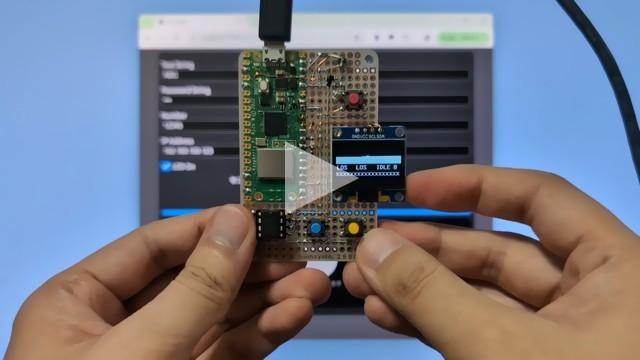
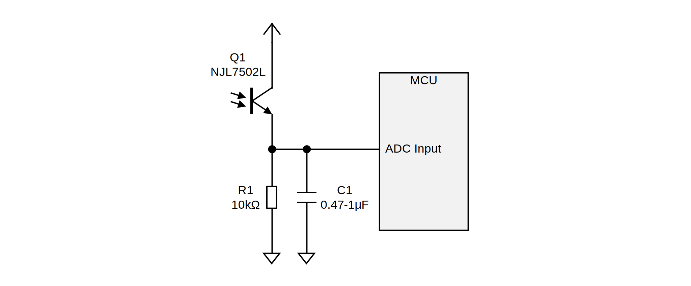
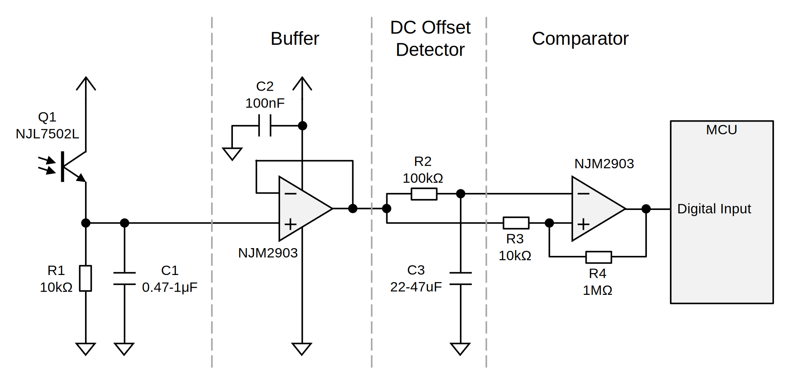
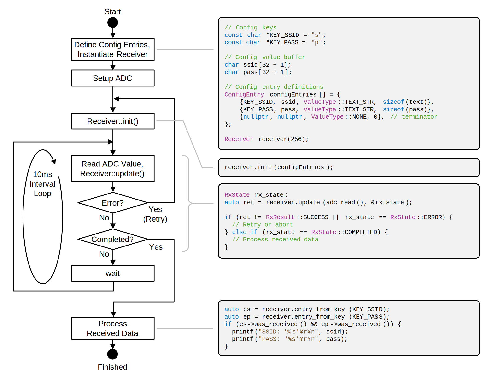

# [WIP] VLConfig

Protocol and library implementation for sending configuration information by flashing the screen of a PC or smartphone to devices that do not have a rich input interface.

リッチな入力インタフェースを持たないデバイスに対し、PC やスマートフォンの画面の点滅によって設定情報を送信するためのプロトコルおよびライブラリ実装です。

# For Arduino Platform

See [VLConfig for Arduino Platform](https://github.com/shapoco/vlconfig-arduino).

# Demo (Raspberry Pi Pico)

See [Demo Program](cpp/example/pico)

## Video (YouTube)

# Transmitter

See [Demo Page](https://shapoco.github.io/vlconfig/demo/).

# Receiver

## Input Circuit

### Using ADC

C1 is required to support displays with brightness controlled by PWM. DC offset and amplitude are detected by software.

### Using Digital GPIO

If a digital input is used, a DC offset detector and comparator are required.

## Decoder Library

See [Library Code](cpp/lib).

# Protocol

## Symbol Table

Each symbol is transmitted in order from the most significant bit.

|Code|Symbol||Code|Symbol||Code|Symbol||Code|Symbol|
|:--:|:--:|:--:|:--:|:--:|:--:|:--:|:--:|:--:|:--:|:--:|
|00000|||01000|||10000|||11000|0xC|
|00001|||01001|0x2||10001|`SYNC`||11001|0xD|
|00010|||01010|`CTRL`||10010|0x7||11010|0xE|
|00011|`SOF`||01011|0x3||10011|0x8||11011||
|00100|||01100|0x4||10100|0x9||11100|0xF|
|00101|0x0||01101|0x5||10101|0xA||11101||
|00110|0x1||01110|0x6||10110|0xB||11110||
|00111|`EOF`||01111|||10111|||11111||

## Frame Format

|Start Sequence|Payload + FCS|End Sequence|
|:--|:--|:--|
|`CTRL` `SYNC` `CTRL` `SYNC` `CTRL` `SOF`|Encoded Bytes|`CTRL` `EOF`|

`CTRL` and `SYNC` are sent alternately between frames.

## Byte Encoding

First the most significant 4 bits of the original byte are encoded, followed by the least significant 4 bits.

## Payload + FCS

Payload is encoded as a subset of [CBOR](https://www.rfc-editor.org/rfc/rfc8949).

|Name|Content|
|:--|:--|
|Object Header|0xA0 + `N`|
|Key \[0\]|Text String|
|Value \[0\]|Text String / Byte String / Boolean|
|Key \[1\]|Text String|
|Value \[1\]|Text String / Byte String / Boolean|
|: :|: :|
|Key \[`N`-1\]|Text String|
|Value \[`N`-1\]|Text String / Byte String / Boolean|
|FCS|CRC32 \[31:24\]|
||CRC32 \[23:16\]|
||CRC32 \[15:8\]|
||CRC32 \[7:0\]|
