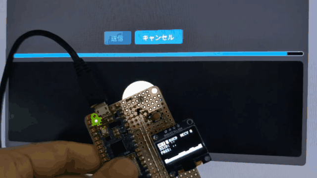
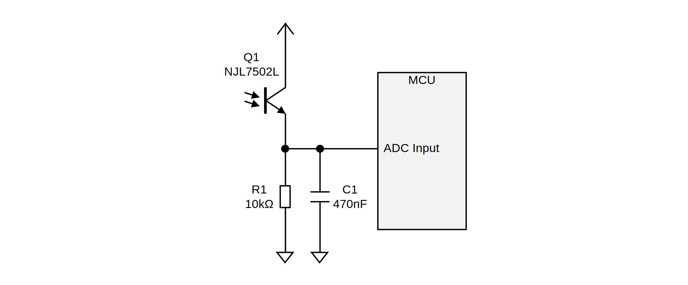

# [WIP] VLConfig

Protocol and library implementation for sending configuration information by flashing the screen of a PC or smartphone to devices that do not have a rich input interface.

リッチな入力インタフェースを持たないデバイスに対し、PC やスマートフォンの画面の点滅によって設定情報を送信するためのプロトコルおよびライブラリ実装です。

# Transmitter

See [Demo Page](https://shapoco.github.io/vlconfig/wifi/).

# Receiver

## Input Circuit

## Decoder Software

See [Library Code](cpp/lib).

## Demo (Raspberry Pi Pico 2 W)

See [Demo Program](cpp/example/pico)

### Connection

|Pico2W|Connection|
|:--|:--|
|GPIO16 (I2C0 SDA)|EEPROM|
|GPIO17 (I2C0 SCL)|EEPROM|
|GPIO18 (I2C1 SDA)|SSD1306|
|GPIO19 (I2C1 SCL)|SSD1306|
|GPIO20|User Switch 0|
|GPIO21|User Switch 1|
|GPIO28 (ADC2)|Optical Sensor|

# Protocol

## Symbol Table

Each symbol is transmitted in order from the most significant bit.

|Code|Symbol||Code|Symbol||Code|Symbol||Code|Symbol|
|:--:|:--:|:--:|:--:|:--:|:--:|:--:|:--:|:--:|:--:|:--:|
|00000|||01000|||10000|||11000|0xC|
|00001|||01001|0x2||10001|`SYNC`||11001|0xD|
|00010|||01010|`CTRL`||10010|0x7||11010|0xE|
|00011|`SOF`||01011|0x3||10011|0x8||11011||
|00100|||01100|0x4||10100|0x9||11100|0xF|
|00101|0x0||01101|0x5||10101|0xA||11101||
|00110|0x1||01110|0x6||10110|0xB||11110||
|00111|`EOF`||01111|||10111|||11111||

## Frame Format

|Start Sequence|Payload + FCS|End Sequence|
|:--|:--|:--|
|`CTRL` `SYNC` `CTRL` `SYNC` `CTRL` `SOF`|Encoded Bytes|`CTRL` `EOF`|

`CTRL` and `SYNC` are sent alternately between frames.

## Byte Encoding

First the most significant 4 bits of the original byte are encoded, followed by the least significant 4 bits.

## Payload + FCS

Payload is encoded as a subset of [CBOR](https://datatracker.ietf.org/doc/html/rfc8949).

|Name|Content|
|:--|:--|
|Object Header|0xA0 + `N`|
|Key \[0\]|Text String|
|Value \[0\]|Text String / Byte String|
|Key \[1\]|Text String|
|Value \[1\]|Text String / Byte String|
|: :|: :|
|Key \[`N`-1\]|Text String|
|Value \[`N`-1\]|Text String / Byte String|
|FCS|CRC32 \[31:24\]|
||CRC32 \[23:16\]|
||CRC32 \[15:8\]|
||CRC32 \[7:0\]|
