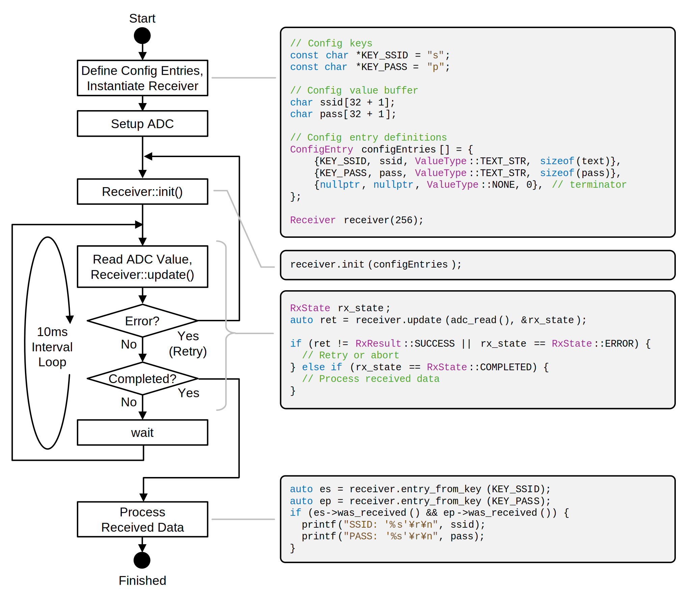

# [WIP] VLConfig

Protocol and library implementation for sending configuration information by flashing the screen of a PC or smartphone to devices that do not have a rich input interface.

リッチな入力インタフェースを持たないデバイスに対し、PC やスマートフォンの画面の点滅によって設定情報を送信するためのプロトコルおよびライブラリ実装です。

# For Arduino Platform

See [VLConfig for Arduino Platform](https://github.com/shapoco/vlconfig-arduino).

# Demo (Raspberry Pi Pico)

See [Demo Program](cpp/example/pico)

## Video (YouTube)

# Transmitter

See [Demo Page](https://shapoco.github.io/vlconfig/).

# Receiver

## Input Circuit

### Using ADC

C1 is required to support displays with brightness controlled by PWM. DC offset and amplitude are detected by software.

### Using Digital GPIO

If a digital input is used, a DC offset detector and comparator are required.

## Decoder Library

See [Library Code](cpp/lib).

# Protocol

## CBOR Encoding

Key/Value pairs are encoded as a subset of [CBOR](https://www.rfc-editor.org/rfc/rfc8949).

## Framing

|Name|Content|
|:--|:--|
|Synchronization|At least 2 × (`CTRL` `SYNC`)|
|Start of Frame|`CTRL` `SOF`|
|Payload|CBOR Object|
|FCS|CRC32 (Polynomial: 0xEDB88320)|
|End of Frame|`CTRL` `EOF`|

`CTRL` and `SYNC` are sent alternately between frames.

## Byte Encoding

First the most significant 4 bits of the original byte are encoded to a symbol, followed by the least significant 4 bits.

ex.) `"Nya"` (0x4E 0x79 0x61) --&gt; `D4` `D14` `D7` `D9` `D6` `D1`

Each symbol is transmitted in order from the most significant bit.

|Symbol|Binary|    |Symbol|Binary|
|:----:|:----:|:--:|:----:|:----:|
|      |00000 |    |      |10000 |
|      |00001 |    |`SYNC`|10001 |
|      |00010 |    |`D7`  |10010 |
|`SOF` |00011 |    |`D8`  |10011 |
|      |00100 |    |`D9`  |10100 |
|`D0`  |00101 |    |`D10` |10101 |
|`D1`  |00110 |    |`D11` |10110 |
|`EOF` |00111 |    |      |10111 |
|      |01000 |    |`D12` |11000 |
|`D2`  |01001 |    |`D13` |11001 |
|`CTRL`|01010 |    |`D14` |11010 |
|`D3`  |01011 |    |      |11011 |
|`D4`  |01100 |    |`D15` |11100 |
|`D5`  |01101 |    |      |11101 |
|`D6`  |01110 |    |      |11110 |
|      |01111 |    |      |11111 |