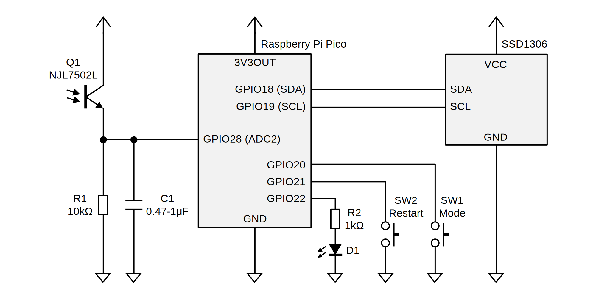

# Demo

## Video (YouTube)

## Schematic

## Connection

|Pico|Connection|
|:--|:--|
|GPIO18 (I2C1 SDA)|SSD1306|
|GPIO19 (I2C1 SCL)|SSD1306|
|GPIO20|Mode Switch|
|GPIO21|Restart Switch|
|GPIO22|LED|
|GPIO28 (ADC2)|Optical Sensor|

## Transmitter

See [Demo Page](https://shapoco.github.io/vlconfig/#demo).
